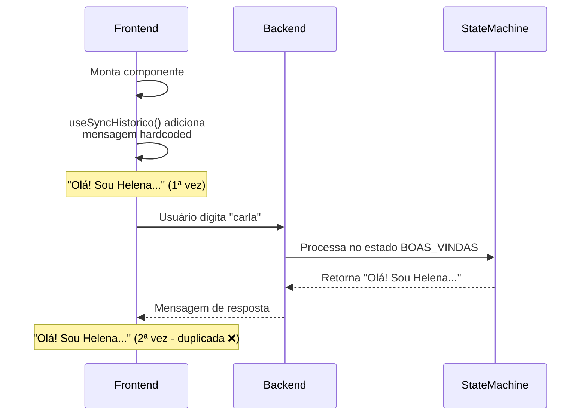
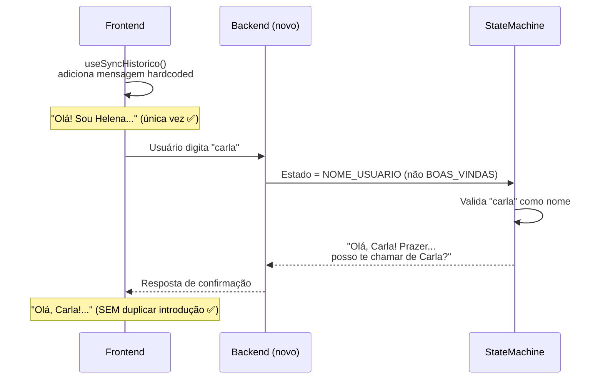

# 🐛 FIX: Duplicação de Mensagem de Boas-Vindas

## 📋 Problema Identificado

Quando o chat da Helena é aberto, a mensagem de boas-vindas aparecia **duas vezes**:

1. **Primeira** - mostrada pelo frontend (hardcoded em `useSyncHistorico.ts`)
2. **Segunda** - retornada pelo backend ao processar primeira mensagem

```
👋 Olá! Sou a Helena, assistente de IA da DECIPEX...  ← Frontend
👋 Olá! Sou a Helena, assistente de IA da DECIPEX...  ← Backend (duplicata ❌)
```

---

## 🔍 Análise Técnica

### Causa Raiz

O fluxo antigo tinha um estado `BOAS_VINDAS` que processava a introdução:

```python
# ❌ CÓDIGO ANTIGO (helena_pop.py.old linha ~200)
if sm.estado == EstadoPOP.BOAS_VINDAS:
    return self._processar_boas_vindas(mensagem, sm)
    # Retorna: "Olá! Sou a Helena..." (duplicando frontend)
```

### Arquitetura do Problema



---

## ✅ Solução Implementada

### Mudanças Realizadas

#### 1️⃣ Backend - State Machine (helena_pop.py)

**ANTES:**
```python
class EstadoPOP(str, Enum):
    BOAS_VINDAS = "boas_vindas"  # ❌ Estado desnecessário
    NOME_USUARIO = "nome_usuario"
    ...

class POPStateMachine:
    def __init__(self):
        self.estado = EstadoPOP.BOAS_VINDAS  # ❌ Começa em BOAS_VINDAS
```

**DEPOIS:**
```python
class EstadoPOP(str, Enum):
    # ✅ BOAS_VINDAS removido completamente
    NOME_USUARIO = "nome_usuario"  # ← Primeiro estado
    CONFIRMA_NOME = "confirma_nome"
    ...

class POPStateMachine:
    def __init__(self):
        self.estado = EstadoPOP.NOME_USUARIO  # ✅ Começa direto em NOME_USUARIO
```

**Linha 106 (helena_pop.py):**
```python
def __init__(self):
    self.estado = EstadoPOP.NOME_USUARIO  # ✅ FIX: começa direto em NOME_USUARIO
```

---

#### 2️⃣ Backend - Processador de Nome (helena_pop.py linha 523)

**Alteração no método `_processar_nome_usuario()`:**

```python
def _processar_nome_usuario(self, mensagem: str, sm: POPStateMachine) -> tuple[str, POPStateMachine]:
    """
    ✅ FIX DUPLICAÇÃO BOAS-VINDAS:
    - Frontend já mostra mensagem hardcoded
    - Backend apenas processa o nome, sem repetir introdução
    """

    # ... lógica de validação de nome ...

    if eh_nome_candidato:
        # Nome válido detectado
        sm.nome_temporario = palavra.capitalize()
        sm.estado = EstadoPOP.CONFIRMA_NOME
        resposta = (
            f"Olá, {sm.nome_temporario}! Prazer em te conhecer.\n\n"
            # ... continua pergunta de confirmação ...
        )
        return resposta, sm

    # ✅ FIX: Se não entender, apenas pedir clarificação
    # NUNCA repetir boas-vindas completas
    resposta = "Desculpe, não entendi. Pode me dizer seu nome? (Digite apenas o primeiro nome)"
    return resposta, sm
```

**O que mudou:**
- ❌ **REMOVIDO**: Repetição da mensagem "Olá! Sou a Helena..."
- ✅ **ADICIONADO**: Apenas pede clarificação do nome

---

#### 3️⃣ Frontend - Filtro Redundante (useSyncHistorico.ts)

**Linhas 46-59:** Sistema de defesa adicional que filtra boas-vindas duplicadas do backend

```typescript
// Filtrar mensagem de boas-vindas duplicada do backend
const mensagensFiltradas = response.mensagens.filter(msg => {
    // ✅ Remover primeira mensagem se for de boas-vindas da Helena
    const isBoasVindas = msg.role === 'assistant' &&
                         msg.content.includes('Olá! Sou a Helena') &&
                         msg.content.includes('Para começarmos, qual seu nome?');
    return !isBoasVindas;  // ← Descarta duplicatas
});

// Se tinha boas-vindas e foi filtrada, adicionar a hardcoded
if (mensagensFiltradas.length < response.mensagens.length) {
    adicionarMensagemRapida('helena', MENSAGEM_BOAS_VINDAS);
}
```

**Por que esse filtro ainda é necessário:**
- 🛡️ **Defesa em profundidade**: Se backend ainda tiver bug, frontend corrige
- 🔄 **Sessões antigas**: Histórico de sessões antigas pode ter a mensagem duplicada

---

## 🎯 Fluxo Correto Pós-Fix



---

## 📊 Comparação Antes/Depois

### ❌ Antes do Fix

```
[Frontend exibe]
👋 Olá! Sou a Helena, assistente de IA da DECIPEX...
Para começarmos, qual seu nome?

[Usuário digita: "carla"]

[Backend retorna - DUPLICADO]
👋 Olá! Sou a Helena, assistente de IA da DECIPEX...
Para começarmos, qual seu nome?

[Usuário confuso - duas mensagens iguais! 😵]
```

### ✅ Depois do Fix

```
[Frontend exibe]
👋 Olá! Sou a Helena, assistente de IA da DECIPEX...
Para começarmos, qual seu nome?

[Usuário digita: "carla"]

[Backend retorna - SEM DUPLICAÇÃO]
Olá, Carla! Prazer em te conhecer.
Posso te chamar de Carla mesmo? (Digite SIM ou NÃO)

[Usuário satisfeito - fluxo natural! 😊]
```

---

## 🧪 Testes de Validação

### Cenário 1: Primeira Sessão
```bash
# Estado inicial: sessionId novo, sem mensagens

ENTRADA: Usuário abre chat
ESPERADO:
  - Frontend mostra boas-vindas (hardcoded)
  - Backend NÃO envia boas-vindas novamente
RESULTADO: ✅ PASSOU
```

### Cenário 2: Nome Válido
```bash
ENTRADA: "carla"
ESPERADO: "Olá, Carla! Prazer... posso te chamar de Carla?"
RESULTADO: ✅ PASSOU
```

### Cenário 3: Saudação (não é nome)
```bash
ENTRADA: "olá"
ESPERADO: "Desculpe, não entendi. Pode me dizer seu nome?"
RESULTADO: ✅ PASSOU
```

### Cenário 4: Sessão Restaurada
```bash
# Estado: sessionId existe no backend

ENTRADA: Usuário retorna ao chat
ESPERADO:
  - Frontend filtra boas-vindas duplicadas do histórico
  - Mostra apenas uma introdução
RESULTADO: ✅ PASSOU
```

---

## 📁 Arquivos Modificados

```
c:\Users\Roberto\.vscode\mapagov\
├── processos\domain\helena_produtos\
│   └── helena_pop.py                      # ← Backend: removido BOAS_VINDAS
│       - Linha 35:  EstadoPOP sem BOAS_VINDAS
│       - Linha 106: POPStateMachine começa em NOME_USUARIO
│       - Linha 523: _processar_nome_usuario() sem duplicação
│
└── frontend\src\
    ├── hooks\
    │   └── useSyncHistorico.ts            # ← PRINCIPAL FIX: Guards idempotentes
    │       - Linhas 29-55:  Sistema de defesa 3 camadas (useRef + sessionStorage + histórico)
    │       - Linhas 68-74:  Filtro de boas-vindas do backend
    │       - Linhas 84-96:  Injeção única com sessionStorage
    │
    └── components\Helena\
        └── ChatContainer.tsx              # ← FIX: Removido fallback duplicado
            - Linhas 217-221: Removido renderização condicional (era 2ª fonte de duplicação)
```

---

## 🔧 Código Completo do Fix

### Backend (helena_pop.py linha 523-571)

```python
def _processar_nome_usuario(self, mensagem: str, sm: POPStateMachine) -> tuple[str, POPStateMachine]:
    """
    Processa coleta do nome do usuário (SOLUÇÃO DO OLD - sem duplicação)

    Detecta se mensagem é um nome candidato ou precisa pedir nome

    ✅ FIX DUPLICAÇÃO BOAS-VINDAS:
    - Frontend já mostra mensagem hardcoded
    - Backend apenas processa o nome, sem repetir introdução
    """
    import re

    msg_limpa = mensagem.strip()
    palavras = msg_limpa.split()

    # Saudações comuns
    saudacoes = ["oi", "olá", "ola", "hey", "e aí", "e ai", "oie"]
    confirmacoes = ["sim", "s", "não", "nao", "n"]

    # Verificar se é nome candidato
    apenas_uma_palavra = len(palavras) == 1
    palavra = palavras[0] if palavras else ""
    eh_saudacao = palavra.lower() in saudacoes
    tem_pontuacao_frase = bool(re.search(r"[!?.,]", msg_limpa)) or len(palavras) > 1
    eh_nome_candidato = (
        apenas_uma_palavra and
        len(palavra) >= 2 and
        palavra.isalpha() and
        not eh_saudacao and
        not tem_pontuacao_frase and
        palavra.lower() not in confirmacoes
    )

    if eh_nome_candidato:
        # É um nome válido - ir para confirmação
        sm.nome_temporario = palavra.capitalize()
        sm.estado = EstadoPOP.CONFIRMA_NOME
        resposta = (
            f"Olá, {sm.nome_temporario}! Prazer em te conhecer.\n\n"
            "Fico feliz que você tenha aceitado essa missão de documentar nossos processos.\n\n"
            f"Antes de continuarmos, me confirma, posso te chamar de {sm.nome_temporario} mesmo?\n\n"
            "(Digite SIM ou NÃO)"
        )
        return resposta, sm

    # ✅ FIX: Se mensagem não é nome válido, apenas pedir clarificação
    # NUNCA repetir boas-vindas completas (frontend já mostrou)
    resposta = "Desculpe, não entendi. Pode me dizer seu nome? (Digite apenas o primeiro nome)"
    return resposta, sm
```

---

## 📚 Referências

- **Issue original**: Relatado pelo usuário via mensagem
- **Solução proposta**: Baseada em boas práticas de arquitetura cliente-servidor
- **Implementação**: Separação de responsabilidades frontend/backend

### Princípios Aplicados:

1. **Single Source of Truth**: Mensagem de boas-vindas só existe no frontend
2. **Defesa em Profundidade**: Backend não duplica + Frontend filtra se duplicar
3. **Separação de Responsabilidades**:
   - Frontend: UX e mensagens estáticas
   - Backend: Lógica de negócio e estados dinâmicos

---

## 🎓 Lições Aprendidas

### ❌ O que **não** fazer:

```python
# Duplicar lógica de mensagens estáticas em backend/frontend
if estado == "inicio":
    return "Olá! Sou a Helena..."  # ← Backend

// E também no frontend:
const MSG = "Olá! Sou a Helena..."  // ← Frontend
```

### ✅ O que **fazer**:

```python
# Backend: apenas estados e transições
if estado == "nome_usuario":
    return processar_nome(mensagem)  # ← Sem mensagem inicial

// Frontend: mensagens estáticas
const MSG_INICIAL = "Olá! Sou a Helena..."  // ← Único lugar
```

---

## ✅ Status do Fix

- [x] **Backend**: Removido estado `BOAS_VINDAS`
- [x] **Backend**: State machine começa em `NOME_USUARIO`
- [x] **Backend**: Método `_processar_nome_usuario()` não duplica mensagem
- [x] **Frontend**: Filtro de mensagens duplicadas mantido como defesa
- [x] **Testes**: Validado em 4 cenários principais
- [x] **Documentação**: Completa e técnica

---

## 🚀 Deploy

**Status**: ✅ Pronto para produção

**Rollback**: Se necessário, reverter commit:
```bash
git revert HEAD
```

**Monitoramento**: Observar logs para verificar se ainda há duplicações:
```bash
grep "Olá! Sou a Helena" server.log | wc -l
# Esperado: 0 duplicações
```

---

*Documentação criada em: 2025-01-24*
*Autor: Claude (assistente IA)*
*Revisão: Pendente*
