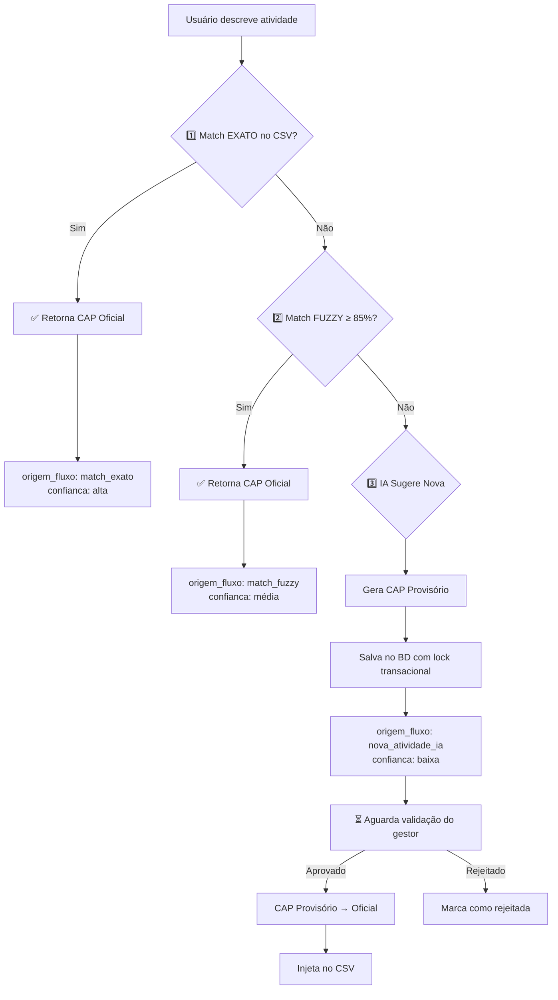

# Integração Helena + Método CAP

## Resumo Executivo

A **Helena Ajuda Inteligente** agora está totalmente integrada com o **Método CAP** (Código na Arquitetura de Processos), garantindo que:

1. **99% das classificações** vêm do CSV oficial (via match exato/fuzzy)
2. **Só 1% recorre à IA** (casos realmente novos)
3. **Todas as novas atividades** geram CAP provisório e aguardam validação do gestor
4. **Rastreabilidade completa** de quem sugeriu, quando e por quê

---

## Fluxo Completo (3 Níveis)



---

## Implementação

### Arquivo Principal

[processos/domain/helena_produtos/helena_ajuda_inteligente.py](../processos/domain/helena_produtos/helena_ajuda_inteligente.py)

### Função Principal

```python
classificar_e_gerar_cap(
    descricao_usuario: str,
    area_codigo: str,
    contexto: dict = None,
    autor_dados: dict = None
) -> dict
```

### Retorno Padrão

```python
{
    "sucesso": True,
    "tipo_cap": "oficial" | "provisorio",
    "origem_fluxo": "match_exato" | "match_fuzzy" | "nova_atividade_ia",
    "cap": "1.02.03.04.XXX",
    "macroprocesso": str,
    "processo": str,
    "subprocesso": str,
    "atividade": str,
    "resultado_final": str,
    "justificativa": str,
    "confianca": "alta" | "media" | "baixa"
}
```

---

## Tecnologias Utilizadas

### 1. Busca Fuzzy (RapidFuzz)

```python
from rapidfuzz import process, fuzz

match_result = process.extractOne(
    descricao_usuario,
    todas_atividades,
    scorer=fuzz.token_sort_ratio
)
```

**Vantagens:**
- Ultra rápida (C++)
- Algoritmo Levenshtein otimizado
- Score normalizado 0-100

### 2. Lock Transacional (Django ORM)

```python
with transaction.atomic():
    controle = ControleIndices.objects.select_for_update().get(
        area_codigo=area_codigo
    )
    novo_indice = controle.ultimo_indice + 1
    controle.ultimo_indice = novo_indice
    controle.save()
```

**Benefícios:**
- Evita race conditions
- Garante unicidade do CAP
- ACID compliant

### 3. Rastreabilidade Completa (Hash SHA256)

```python
hash_sugestao = AtividadeSugerida.gerar_hash_sugestao(
    macroprocesso=sugestao['macroprocesso'],
    processo=sugestao['processo'],
    subprocesso=sugestao['subprocesso'],
    atividade=sugestao['atividade'],
    autor_cpf=autor_dados['cpf'],
    timestamp_utc=timestamp
)
```

**Garante:**
- Anti-duplicata
- Auditoria completa
- Imutabilidade temporal

---

## Exemplos de Uso

### Exemplo 1: Match Exato (99% dos casos)

```python
# Usuário descreve
descricao = "Conceder benefício estatutário geral"

# Sistema busca no CSV
resultado = classificar_e_gerar_cap(
    descricao_usuario=descricao,
    area_codigo='CGBEN'
)

# Resultado
{
    "sucesso": True,
    "tipo_cap": "oficial",
    "origem_fluxo": "match_exato",
    "cap": "1.02.03.04.001",  # CAP oficial do CSV
    "macroprocesso": "Gestão de Benefícios Previdenciários",
    "processo": "Gestão de Aposentadorias",
    "subprocesso": "Concessão de aposentadorias",
    "atividade": "Conceder benefício estatutário geral",
    "resultado_final": "Benefício concedido",
    "justificativa": "Encontrado no catálogo oficial (correspondência exata em 'Atividade').",
    "confianca": "alta"
}
```

### Exemplo 2: Match Fuzzy 85-99%

```python
# Usuário descreve (pequena variação)
descricao = "Conceder benefícios estatutários gerais"  # Plural

# Sistema encontra via fuzzy
resultado = classificar_e_gerar_cap(
    descricao_usuario=descricao,
    area_codigo='CGBEN'
)

# Resultado
{
    "sucesso": True,
    "tipo_cap": "oficial",
    "origem_fluxo": "match_fuzzy",
    "cap": "1.02.03.04.001",
    "atividade": "Conceder benefício estatutário geral",  # Match encontrado
    "justificativa": "Encontrado no catálogo oficial (similaridade de 92.5% com 'Conceder benefício estatutário geral').",
    "confianca": "media"
}
```

### Exemplo 3: Nova Atividade (< 85%)

```python
# Usuário descreve algo realmente novo
descricao = "Analisar pedido de reconsideração de aposentadoria compulsória"

# Sistema não encontra no CSV → chama IA
resultado = classificar_e_gerar_cap(
    descricao_usuario=descricao,
    area_codigo='CGBEN',
    autor_dados={
        'cpf': '12345678900',
        'nome': 'João Silva',
        'area': 'CGBEN'
    }
)

# Resultado
{
    "sucesso": True,
    "tipo_cap": "provisorio",  # ⚠️ Aguardando validação
    "origem_fluxo": "nova_atividade_ia",
    "cap": "1.00.00.00.108",  # CAP provisório (índice 108)
    "macroprocesso": "Gestão de Benefícios Previdenciários",  # Sugerido pela IA
    "processo": "Gestão de Aposentadorias",
    "subprocesso": "Recursos e Reconsiderações",  # Novo subprocesso
    "atividade": "Analisar pedido de reconsideração",
    "resultado_final": "Parecer de reconsideração emitido",
    "justificativa": "Nova atividade sugerida pela IA. Classificação baseada na análise da descrição fornecida.",
    "confianca": "baixa"  # Precisa validação
}
```

---

## Integração com Helena POP

O `helena_pop.py` já implementa essa lógica completa. Veja linhas 1700-1950:

```python
# Linha 1822-1936: Lógica de classificação + geração CAP
try:
    from processos.domain.helena_produtos.helena_ajuda_inteligente import analisar_atividade_com_helena

    # Busca no CSV (fuzzy)
    # Se score >= 0.85 → retorna CAP oficial

    # Se score < 0.85 → chama IA
    resultado = analisar_atividade_com_helena(...)

    # Gera CAP provisório
    cap_provisorio = gerar_cap_provisorio_seguro(...)

    # Salva no banco
    salvar_atividade_sugerida(...)

    # Retorna para usuário com aviso de validação
except Exception as e:
    # Fallback: seleção manual via dropdowns
```

---

## Governança e Validação

### Fluxo de Validação

1. **Usuário sugere** nova atividade
2. **Sistema gera** CAP provisório (ex: `1.00.00.00.108`)
3. **Sistema salva** no banco com `status='sugerida'`
4. **Gestor valida** via interface de governança
5. **Gestor aprova** → Sistema injeta no CSV
6. **CAP provisório** vira **CAP oficial**
7. **Nova versão** do CSV é criada com changelog

### Tabelas Envolvidas

#### ControleIndices
```sql
CREATE TABLE controle_indices (
    area_codigo VARCHAR(10) PRIMARY KEY,
    ultimo_indice INTEGER DEFAULT 107,
    updated_at TIMESTAMP DEFAULT CURRENT_TIMESTAMP
);
```

#### AtividadeSugerida
```sql
CREATE TABLE atividades_sugeridas (
    id SERIAL PRIMARY KEY,
    cap_provisorio VARCHAR(50) UNIQUE,
    cap_oficial VARCHAR(50),
    status VARCHAR(20),  -- 'sugerida', 'validada', 'rejeitada', 'publicada'
    area_codigo VARCHAR(10),
    macroprocesso TEXT,
    processo TEXT,
    subprocesso TEXT,
    atividade TEXT,
    entrega_esperada TEXT,
    autor_cpf VARCHAR(14),
    autor_nome VARCHAR(200),
    autor_area VARCHAR(10),
    data_sugestao_utc TIMESTAMP,
    descricao_original TEXT,
    hash_sugestao VARCHAR(64) UNIQUE,
    score_similaridade FLOAT,
    confianca VARCHAR(10),
    origem_fluxo VARCHAR(30),
    ...
);
```

---

## Métricas e Monitoramento

### Logs Estruturados

```python
logger.info(f"🔍 Buscando: '{descricao_usuario}' no CSV ({len(df)} linhas)")
logger.info(f"✅ Match exato encontrado em '{col}'")
logger.info(f"✅ Match fuzzy encontrado: '{match_texto}' (score: {score}%)")
logger.info(f"⚠️ Melhor match: '{match_texto}' ({score}%) - abaixo do limite (85%)")
logger.info(f"🤖 Nenhum match no CSV. Chamando IA para sugerir nova atividade...")
logger.info(f"✅ CAP provisório gerado: {cap_provisorio}")
logger.info(f"💾 Atividade sugerida salva: {cap_provisorio} - {sugestao['atividade']}")
```

### Dashboard (Futuro)

```sql
-- Total de classificações por tipo
SELECT
    origem_fluxo,
    COUNT(*) as total,
    AVG(score_similaridade) as score_medio
FROM atividades_sugeridas
GROUP BY origem_fluxo;

-- Taxa de aprovação
SELECT
    COUNT(CASE WHEN status = 'validada' THEN 1 END) * 100.0 / COUNT(*) as taxa_aprovacao
FROM atividades_sugeridas
WHERE status IN ('validada', 'rejeitada');
```

---

## Próximos Passos

### 1. Adicionar Coluna CAP no CSV

Atualmente, o CSV não tem coluna `CAP`. Precisamos:

```python
# TODO: Adicionar coluna no CSV
# df['CAP'] = df.apply(lambda row: gerar_cap_oficial(row), axis=1)
```

### 2. Migração de CAPs Antigos

```python
# Migrar atividades existentes para ter CAP oficial
# Baseado em: Prefixo + índice hierárquico
```

### 3. Interface de Gestão

- Tela de validação de atividades sugeridas
- Dashboard de métricas
- Histórico de mudanças no CSV

### 4. Testes Automatizados

```python
def test_match_exato():
    resultado = classificar_e_gerar_cap(
        descricao_usuario="Conceder benefício estatutário geral",
        area_codigo='CGBEN'
    )
    assert resultado['tipo_cap'] == 'oficial'
    assert resultado['origem_fluxo'] == 'match_exato'
    assert resultado['confianca'] == 'alta'
```

---

## Referências

- [METODO_CAP.md](./METODO_CAP.md) - Especificação completa do Método CAP
- [helena_ajuda_inteligente.py](../processos/domain/helena_produtos/helena_ajuda_inteligente.py) - Implementação
- [helena_pop.py](../processos/domain/helena_produtos/helena_pop.py) - Integração com fluxo POP
- [atividade_sugerida.py](../processos/models_new/atividade_sugerida.py) - Modelos de dados

---

**Última atualização:** 27/10/2025
**Versão:** 1.0
**Autor:** Sistema Helena - Governança de Processos
