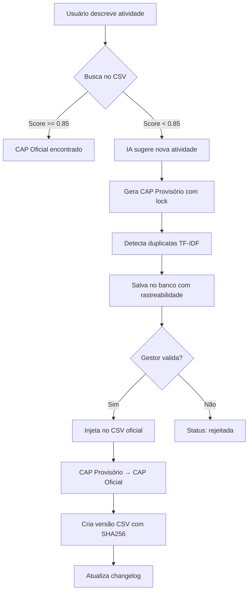

# Método CAP - Código na Arquitetura de Processos

## Visão Geral

O **CAP (Código na Arquitetura de Processos)** é o identificador único e hierárquico de cada atividade mapeada na DECIPEX. Funciona como o "CPF da atividade", permitindo rastreamento, versionamento e governança completa do catálogo de processos.

## Formato do Código

```
PREFIXO_AREA.IDX_MACRO.IDX_PROCESSO.IDX_SUB.IDX_ATIVIDADE
```

### Exemplo Real

```
1.02.03.04.108
│ │  │  │  └── Índice da Atividade (108 = primeira atividade nova da área)
│ │  │  └──── Índice do Subprocesso (04)
│ │  └─────── Índice do Processo (03)
│ └────────── Índice do Macroprocesso (02)
└──────────── Prefixo da Área (1 = CGBEN)
```

## Prefixos de Área

| Código | Nome da Área | Prefixo |
|--------|--------------|---------|
| CGBEN  | Coordenação Geral de Benefícios | 1 |
| CGPAG  | Coordenação Geral de Pagamentos | 2 |
| COATE  | Coordenação de Atendimento | 3 |
| CGGAF  | Coordenação Geral de Gestão de Acervos Funcionais | 4 |
| DIGEP  | Diretoria de Pessoal dos Ex-Territórios | 5 |
| CGRIS  | Coordenação Geral de Riscos e Controle | 6 |
| CGCAF  | Coordenação Geral de Gestão de Complementação da Folha | 7 |
| CGECO  | Coordenação Geral de Extinção e Convênio | 8 |

## Tipos de CAP

### 1. CAP Oficial
- Atividades das **107 já mapeadas** no catálogo oficial (CSV)
- Extraído diretamente do arquivo `Arquitetura_DECIPEX_mapeada.csv`
- Exemplo: `1.02.03.04.001` a `1.02.03.04.107`

### 2. CAP Provisório
- Novas atividades **sugeridas pela IA** ou pelos usuários
- Gerado automaticamente com **lock transacional** (evita duplicação)
- Inicia em `108` para cada área
- Exemplo: `1.02.03.04.108`, `1.02.03.04.109`, etc.
- **Status**: Aguardando validação do gestor

### 3. CAP Oficial (após aprovação)
- CAP Provisório se torna **CAP Oficial** após validação do gestor
- Atividade é injetada no CSV oficial
- Nova versão do CSV é criada automaticamente

## Geração de CAP - Sistema de Locks

Para evitar **race conditions** (dois usuários gerando o mesmo CAP ao mesmo tempo), implementamos controle transacional:

### Tabela `controle_indices`

```sql
CREATE TABLE controle_indices (
    area_codigo VARCHAR(10) PRIMARY KEY,
    ultimo_indice INTEGER DEFAULT 107,
    updated_at TIMESTAMP DEFAULT CURRENT_TIMESTAMP
);
```

### Algoritmo de Geração

```python
# 1. Lock transacional (evita race condition)
with transaction.atomic():
    controle = ControleIndices.objects.select_for_update().get(
        area_codigo='CGBEN'
    )

    proximo_indice = controle.ultimo_indice + 1  # 108, 109, 110...
    controle.ultimo_indice = proximo_indice
    controle.save()

# 2. Montar CAP hierárquico
cap = f"{prefixo_area}.{idx_macro:02d}.{idx_processo:02d}.{idx_sub:02d}.{idx_ativ:03d}"
# Exemplo: 1.02.03.04.108
```

### Por que `select_for_update()`?

Sem lock transacional:
```
Usuário A lê ultimo_indice = 107
Usuário B lê ultimo_indice = 107  ❌ Race condition!
Usuário A grava 108
Usuário B grava 108  ❌ CAP duplicado!
```

Com lock transacional:
```
Usuário A bloqueia a linha (SELECT FOR UPDATE)
Usuário A lê ultimo_indice = 107
Usuário A grava 108
Usuário A libera lock ✅
Usuário B bloqueia a linha
Usuário B lê ultimo_indice = 108
Usuário B grava 109 ✅
```

## Ciclo de Vida de uma Nova Atividade

### Fluxo Completo



### Estados no Banco de Dados

| Status | Descrição |
|--------|-----------|
| `sugerida` | Aguardando validação do gestor |
| `validada` | Aprovada pelo gestor, pronta para publicação |
| `rejeitada` | Rejeitada pelo gestor (não será publicada) |
| `publicada` | Injetada no CSV oficial e disponível para todos |

## Rastreabilidade Completa

Cada CAP Provisório registra:

### Dados do Autor
```python
{
    "autor_cpf": "12345678900",
    "autor_nome": "João Silva",
    "autor_area": "CGBEN",
    "data_sugestao_utc": "2025-10-26T23:45:00Z"
}
```

### Dados da Validação
```python
{
    "validador_cpf": "98765432100",
    "validador_nome": "Maria Santos",
    "validador_cargo": "Gestor CGBEN",
    "data_validacao_utc": "2025-10-27T10:30:00Z",
    "comentario_validacao": "Aprovado - atividade relevante"
}
```

### Detecção de Duplicatas
```python
{
    "hash_sugestao": "a3f8d9e2...",  # SHA256 (anti-duplicata)
    "score_similaridade": 0.73,       # Score máximo encontrado
    "sugestoes_similares": [           # Atividades similares (score > 0.8)
        {
            "cap": "1.02.03.04.110",
            "atividade": "Analisar requerimento...",
            "score": 0.85,
            "autor": "Pedro Costa"
        }
    ],
    "scores_similares_todos": [0.85, 0.73, 0.42, ...]  # Todos os scores
}
```

### Origem do Fluxo
- `match_exato` - Encontrado no CSV com score >= 0.95
- `match_fuzzy` - Encontrado no CSV com score >= 0.85
- `nova_atividade_ia` - Sugerida pela IA (score < 0.85)
- `selecao_manual` - Selecionada via dropdowns hierárquicos

## Versionamento do CSV

Cada vez que uma atividade é injetada no CSV, uma nova versão é criada:

### Formato de Versão
```
Arquitetura_DECIPEX_vYYYYMMDD_HHMMSS_NNN.csv
```

Exemplo:
```
Arquitetura_DECIPEX_v20251026_234500_001.csv
Arquitetura_DECIPEX_v20251027_103000_002.csv
```

### Changelog (JSON)
```json
{
  "versoes": [
    {
      "versao": "Arquitetura_DECIPEX_v20251026_234500_001.csv",
      "hash_sha256": "a3f8d9e2c4b5...",
      "timestamp_utc": "2025-10-26T23:45:00Z",
      "motivo": "Injeção de atividade validada: 1.02.03.04.108",
      "atividades_adicionadas": [
        {
          "cap": "1.02.03.04.108",
          "macroprocesso": "Gestão de Benefícios",
          "processo": "Concessão de Aposentadorias",
          "subprocesso": "Análise de Requerimentos",
          "atividade": "Analisar pedido de reconsideração",
          "autor": "João Silva",
          "validador": "Maria Santos",
          "data_sugestao": "2025-10-26T23:45:00Z",
          "data_validacao": "2025-10-27T10:30:00Z"
        }
      ],
      "total_atividades": 1
    }
  ]
}
```

## Benefícios do Método CAP

### 1. **Unicidade Garantida**
- Cada atividade tem um identificador único
- Impossível criar duplicatas (lock transacional)

### 2. **Rastreabilidade Total**
- Quem sugeriu (autor)
- Quem validou (gestor)
- Quando foi criada/validada (UTC)
- Por que foi criada (descrição original)

### 3. **Governança Rigorosa**
- Todas as sugestões passam por validação
- Histórico completo de mudanças (audit trail)
- CSV versionado com hash SHA256

### 4. **Detecção de Duplicatas**
- Algoritmo TF-IDF + Cosine Similarity
- Alerta quando há atividades similares
- Scores salvos para análise futura

### 5. **Evolução Controlada**
- CSV oficial cresce de forma organizada
- Novas atividades não sobrescrevem antigas
- Versionamento permite rollback se necessário

### 6. **Multi-Área**
- Mesma atividade pode existir em áreas diferentes
- Cada área tem seu próprio contador (107 → 108 → 109...)
- CAPs diferentes mesmo com descrição similar

## Exemplo Prático

### Cenário: Nova Atividade Sugerida

1. **Usuário descreve**: "Analisar pedido de reconsideração de aposentadoria"

2. **Sistema busca no CSV** (107 atividades mapeadas)
   - Score: 0.72 (< 0.85) ❌ Não encontrado

3. **IA sugere nova arquitetura**:
   ```
   Macroprocesso: Gestão de Benefícios Previdenciários
   Processo: Gestão de Aposentadorias
   Subprocesso: Recursos e Reconsiderações
   Atividade: Analisar pedido de reconsideração
   ```

4. **Sistema gera CAP Provisório**:
   ```python
   # Lock transacional
   controle = ControleIndices.objects.select_for_update().get(area_codigo='CGBEN')
   # CGBEN estava em 107, agora vai para 108
   cap_provisorio = "1.02.03.04.108"
   ```

5. **Sistema detecta similares**:
   - Busca atividades similares já sugeridas
   - Encontra: `1.02.03.05.109` - "Analisar recurso administrativo" (score: 0.82)
   - Alerta usuário sobre a similaridade

6. **Sistema salva com rastreabilidade**:
   ```python
   AtividadeSugerida.objects.create(
       cap_provisorio="1.02.03.04.108",
       status="sugerida",
       area_codigo="CGBEN",
       autor_cpf="12345678900",
       autor_nome="João Silva",
       hash_sugestao="a3f8d9e2...",
       score_similaridade=0.82,
       origem_fluxo="nova_atividade_ia",
       # ... mais campos
   )
   ```

7. **Gestor valida**:
   - Acessa interface de gestão
   - Aprova a sugestão
   - Sistema injeta no CSV
   - CAP Provisório `1.02.03.04.108` → CAP Oficial `1.02.03.04.108`

8. **Nova versão do CSV**:
   ```
   Arquitetura_DECIPEX_v20251027_103000_002.csv
   Hash: b7c4e1f3...
   Total de atividades: 108 (107 + 1)
   ```

## Consultas Úteis

### Listar todas as atividades sugeridas pendentes
```python
pendentes = AtividadeSugerida.objects.filter(status='sugerida')
for ativ in pendentes:
    print(f"{ativ.cap_provisorio}: {ativ.atividade} (por {ativ.autor_nome})")
```

### Verificar próximo índice de uma área
```python
controle = ControleIndices.objects.get(area_codigo='CGBEN')
print(f"Próximo CAP: 1.02.03.04.{controle.ultimo_indice + 1}")
```

### Histórico de uma atividade
```python
atividade = AtividadeSugerida.objects.get(cap_provisorio='1.02.03.04.108')
historico = HistoricoAtividade.objects.filter(atividade=atividade)
for evento in historico:
    print(f"{evento.tipo_evento} - {evento.data_evento_utc} - {evento.usuario_nome}")
```

## Referências

- Implementação: [`processos/domain/helena_produtos/helena_pop.py`](../processos/domain/helena_produtos/helena_pop.py)
- Modelos: [`processos/models_new/atividade_sugerida.py`](../processos/models_new/atividade_sugerida.py)
- Migration: [`processos/migrations/0013_add_atividades_sugeridas.py`](../processos/migrations/0013_add_atividades_sugeridas.py)
- CSV de Atividades: [`documentos_base/Arquitetura_DECIPEX_mapeada.csv`](../documentos_base/Arquitetura_DECIPEX_mapeada.csv)
- CSV de Áreas: [`documentos_base/areas_organizacionais.csv`](../documentos_base/areas_organizacionais.csv)

---

**Última atualização**: 26/10/2025
**Versão**: 1.0
**Autor**: Sistema Helena - Governança de Processos
